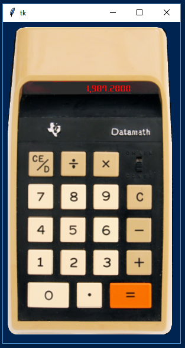

# PyDataMath
A simple Python calculator gui application based on the Texas Instruments Datamath produced circa 1972. You can [read more](http://www.datamath.org/) about the history of this interesting calcuator.

This project builds a GUI with a transparent background with **clickable picture buttons** created from the original image. This is as close as you can get to using one without actually having one!

If you're looking for some experience with a GUI, or you want to add a project to your Python portfolio, this is a great place to start.

The code includes 4 progressive steps used to build the application as part of a [YouTube]() tutorial. Step 4 is the finished product.

Tkinter should already be installed with your python distribution. But if not, you can install with `pip install tkinter`

I'm using a [Digital-7 font](https://www.1001fonts.com/digital+clock-fonts.html) on the display. Download and install if you want to use it, but it's optional. You can use another font if you choose, such as "OCR A Extended" which comes packaged with Windows. But, I think the Digital-7 font looks nice. Please keep in mind that the text field sizing is based on the selected font, so if you use another font-type, you may need to tweek the button sizes.

